```python
import pandas as pd
import matplotlib.pyplot as plt

pd.option_context('display.max_rows', 1000, 'display.max_columns', 1000)

def old_float(str):
    try: 
        return float(str.replace('.','').replace(',','.'))
    except:
        return 0

def new_float(str):
    try: 
        return float(str)
    except:
        return 0
    
CONVERTERS_OLD = {
    "1r Trimestre": old_float,
    "2n Trimestre": old_float,
    "3r Trimestre": old_float,
    "4rt Trimestre": old_float,
    
    "1r Trimestre.1": old_float,
    "2n Trimestre.1": old_float,
    "3r Trimestre.1": old_float,
    "4rt Trimestre.1": old_float,
    
    "Acumulat/1r Trimestre": old_float,
    "Acumulat/2n Trimestre": old_float,
    "Acumulat/3r Trimestre": old_float,
    "Acumulat/4rt Trimestre": old_float
}

CONVERTERS_NEW = {
    "1r Trimestre": new_float,
    "2n Trimestre": new_float,
    "3r Trimestre": new_float,
    "4rt Trimestre": new_float,
    
    "1r Trimestre.1": new_float,
    "2n Trimestre.1": new_float,
    "3r Trimestre.1": new_float,
    "4rt Trimestre.1": new_float,
    
    "Acumulat/1r Trimestre": new_float,
    "Acumulat/2n Trimestre": new_float,
    "Acumulat/3r Trimestre": new_float,
    "Acumulat/4rt Trimestre": new_float
}
```


```python
def parse_old_rent_dataset(df_name):
    df = pd.read_csv("../lib/avg-rent-eur-month/" + df_name, thousands=".", decimal=",", converters=CONVERTERS_OLD)
    return df.rename(columns={"1r Trimestre.1": "Acumulat/1r Trimestre", "2n Trimestre.1": "Acumulat/2n Trimestre", "3r Trimestre.1": "Acumulat/3r Trimestre", "4rt Trimestre.1": "Acumulat/4rt Trimestre"})[1:]

def parse_rent_dataset(df_name):
    return pd.read_csv("../lib/avg-rent-eur-month/" + df_name, converters=CONVERTERS_NEW)

def normalize(df, year):
    to_drop = ['Acumulat/1r Trimestre', 'Acumulat/2n Trimestre', 'Acumulat/3r Trimestre', 'Acumulat/4rt Trimestre', 'Dte.']
    df = df.drop(axis="columns", labels=to_drop)
    
    cols = ['1r Trimestre', '2n Trimestre', '3r Trimestre', '4rt Trimestre']
    for period in cols:
        rename_op = {}
        rename_op[period] = year + "/" + period
        df = df.rename(columns=rename_op)
        
    return df

def merge_rates(*dfs):
    df = dfs[0]
    for d in dfs[1:]:
        df = df.merge(d, how="left", on="Barris")
    
    return df
```


```python
monthly_rate_2014 = parse_old_rent_dataset("2014.csv")
monthly_rate_2015 = parse_old_rent_dataset("2015.csv")
monthly_rate_2016 = parse_old_rent_dataset("2016.csv")
monthly_rate_2017 = parse_rent_dataset("2017.csv")
monthly_rate_2018 = parse_rent_dataset("2018.csv")

monthly_rate_2014 = normalize(monthly_rate_2014, '2014')
monthly_rate_2015 = normalize(monthly_rate_2015, '2015')
monthly_rate_2016 = normalize(monthly_rate_2016, '2016')
monthly_rate_2017 = normalize(monthly_rate_2017, '2017')
monthly_rate_2018 = normalize(monthly_rate_2018, '2018')

all_monthly_rates = merge_rates(monthly_rate_2014, monthly_rate_2015, monthly_rate_2016, monthly_rate_2017, monthly_rate_2018)
all_monthly_rates = all_monthly_rates.fillna(0)

all_monthly_rates
```


<div>
<style scoped>
    .dataframe tbody tr th:only-of-type {
        vertical-align: middle;
    }

    .dataframe tbody tr th {
        vertical-align: top;
    }

    .dataframe thead th {
        text-align: right;
    }
</style>
<table border="1" class="dataframe">
  <thead>
    <tr style="text-align: right;">
      <th></th>
      <th>Barris</th>
      <th>2014/1r Trimestre</th>
      <th>2014/2n Trimestre</th>
      <th>2014/3r Trimestre</th>
      <th>2014/4rt Trimestre</th>
      <th>2015/1r Trimestre</th>
      <th>2015/2n Trimestre</th>
      <th>2015/3r Trimestre</th>
      <th>2015/4rt Trimestre</th>
      <th>2016/1r Trimestre</th>
      <th>...</th>
      <th>2016/3r Trimestre</th>
      <th>2016/4rt Trimestre</th>
      <th>2017/1r Trimestre</th>
      <th>2017/2n Trimestre</th>
      <th>2017/3r Trimestre</th>
      <th>2017/4rt Trimestre</th>
      <th>2018/1r Trimestre</th>
      <th>2018/2n Trimestre</th>
      <th>2018/3r Trimestre</th>
      <th>2018/4rt Trimestre</th>
    </tr>
  </thead>
  <tbody>
    <tr>
      <th>0</th>
      <td>1. el Raval</td>
      <td>589.55</td>
      <td>550.63</td>
      <td>576.45</td>
      <td>597.00</td>
      <td>601.3</td>
      <td>598.9</td>
      <td>654.0</td>
      <td>644.7</td>
      <td>624.4</td>
      <td>...</td>
      <td>666.2</td>
      <td>716.7</td>
      <td>734.99</td>
      <td>714.29</td>
      <td>764.85</td>
      <td>776.73</td>
      <td>792.74</td>
      <td>820.88</td>
      <td>849.32</td>
      <td>827.27</td>
    </tr>
    <tr>
      <th>1</th>
      <td>2. el Barri Gòtic</td>
      <td>712.79</td>
      <td>728.79</td>
      <td>790.74</td>
      <td>761.68</td>
      <td>756.7</td>
      <td>771.1</td>
      <td>773.0</td>
      <td>831.1</td>
      <td>893.4</td>
      <td>...</td>
      <td>851.6</td>
      <td>914.0</td>
      <td>905.26</td>
      <td>968.16</td>
      <td>1028.49</td>
      <td>993.16</td>
      <td>998.40</td>
      <td>1024.29</td>
      <td>1012.49</td>
      <td>1057.26</td>
    </tr>
    <tr>
      <th>2</th>
      <td>3. la Barceloneta</td>
      <td>540.71</td>
      <td>541.93</td>
      <td>578.88</td>
      <td>593.73</td>
      <td>581.3</td>
      <td>598.2</td>
      <td>630.0</td>
      <td>601.4</td>
      <td>638.7</td>
      <td>...</td>
      <td>686.6</td>
      <td>686.3</td>
      <td>722.78</td>
      <td>738.25</td>
      <td>758.18</td>
      <td>766.03</td>
      <td>870.84</td>
      <td>923.45</td>
      <td>889.24</td>
      <td>913.20</td>
    </tr>
    <tr>
      <th>3</th>
      <td>4. Sant Pere, Santa Caterina i la Ribera</td>
      <td>673.44</td>
      <td>676.98</td>
      <td>699.10</td>
      <td>687.33</td>
      <td>697.2</td>
      <td>708.0</td>
      <td>729.0</td>
      <td>751.6</td>
      <td>759.2</td>
      <td>...</td>
      <td>839.6</td>
      <td>854.2</td>
      <td>895.28</td>
      <td>930.13</td>
      <td>927.16</td>
      <td>914.78</td>
      <td>923.44</td>
      <td>991.39</td>
      <td>970.97</td>
      <td>1000.52</td>
    </tr>
    <tr>
      <th>4</th>
      <td>5. el Fort Pienc</td>
      <td>736.09</td>
      <td>706.16</td>
      <td>719.84</td>
      <td>735.99</td>
      <td>753.8</td>
      <td>770.1</td>
      <td>753.0</td>
      <td>792.5</td>
      <td>800.1</td>
      <td>...</td>
      <td>868.3</td>
      <td>816.5</td>
      <td>871.08</td>
      <td>884.99</td>
      <td>933.54</td>
      <td>910.78</td>
      <td>910.53</td>
      <td>942.96</td>
      <td>968.85</td>
      <td>983.10</td>
    </tr>
    <tr>
      <th>5</th>
      <td>6. la Sagrada Família</td>
      <td>673.37</td>
      <td>663.23</td>
      <td>697.69</td>
      <td>687.26</td>
      <td>679.0</td>
      <td>704.4</td>
      <td>739.0</td>
      <td>726.9</td>
      <td>752.4</td>
      <td>...</td>
      <td>799.4</td>
      <td>806.4</td>
      <td>847.04</td>
      <td>867.97</td>
      <td>906.78</td>
      <td>877.02</td>
      <td>883.75</td>
      <td>893.43</td>
      <td>934.89</td>
      <td>930.02</td>
    </tr>
    <tr>
      <th>6</th>
      <td>7. la Dreta de l'Eixample</td>
      <td>921.40</td>
      <td>948.96</td>
      <td>934.55</td>
      <td>975.96</td>
      <td>957.6</td>
      <td>988.9</td>
      <td>1052.0</td>
      <td>1035.1</td>
      <td>1104.3</td>
      <td>...</td>
      <td>1144.0</td>
      <td>1174.4</td>
      <td>1151.09</td>
      <td>1218.18</td>
      <td>1179.11</td>
      <td>1225.08</td>
      <td>1191.43</td>
      <td>1263.08</td>
      <td>1216.70</td>
      <td>1340.38</td>
    </tr>
    <tr>
      <th>7</th>
      <td>8. l'Antiga Esquerra de l'Eixample</td>
      <td>827.87</td>
      <td>821.81</td>
      <td>869.72</td>
      <td>848.56</td>
      <td>859.6</td>
      <td>906.1</td>
      <td>926.0</td>
      <td>941.6</td>
      <td>947.3</td>
      <td>...</td>
      <td>986.2</td>
      <td>1012.2</td>
      <td>1001.49</td>
      <td>1044.28</td>
      <td>1098.21</td>
      <td>1081.29</td>
      <td>1069.16</td>
      <td>1078.13</td>
      <td>1136.21</td>
      <td>1164.32</td>
    </tr>
    <tr>
      <th>8</th>
      <td>9. la Nova Esquerra de l'Eixample</td>
      <td>716.13</td>
      <td>708.00</td>
      <td>746.78</td>
      <td>753.61</td>
      <td>766.2</td>
      <td>766.9</td>
      <td>807.0</td>
      <td>789.8</td>
      <td>811.6</td>
      <td>...</td>
      <td>890.5</td>
      <td>926.2</td>
      <td>909.08</td>
      <td>949.96</td>
      <td>950.15</td>
      <td>957.00</td>
      <td>947.92</td>
      <td>975.53</td>
      <td>1003.89</td>
      <td>1017.56</td>
    </tr>
    <tr>
      <th>9</th>
      <td>10. Sant Antoni</td>
      <td>693.43</td>
      <td>718.01</td>
      <td>713.89</td>
      <td>720.14</td>
      <td>740.4</td>
      <td>746.0</td>
      <td>798.0</td>
      <td>772.1</td>
      <td>805.9</td>
      <td>...</td>
      <td>883.3</td>
      <td>882.5</td>
      <td>876.97</td>
      <td>887.78</td>
      <td>922.46</td>
      <td>905.83</td>
      <td>899.98</td>
      <td>907.42</td>
      <td>970.26</td>
      <td>960.30</td>
    </tr>
    <tr>
      <th>10</th>
      <td>11. el Poble Sec - AEI Parc Montjuïc</td>
      <td>568.00</td>
      <td>578.65</td>
      <td>580.89</td>
      <td>602.55</td>
      <td>578.8</td>
      <td>598.5</td>
      <td>631.0</td>
      <td>638.5</td>
      <td>622.2</td>
      <td>...</td>
      <td>696.7</td>
      <td>706.1</td>
      <td>715.71</td>
      <td>756.80</td>
      <td>759.87</td>
      <td>760.23</td>
      <td>783.50</td>
      <td>788.23</td>
      <td>822.04</td>
      <td>813.74</td>
    </tr>
    <tr>
      <th>11</th>
      <td>12. la Marina del Prat Vermell - AEI Zona Franca</td>
      <td>0.00</td>
      <td>0.00</td>
      <td>0.00</td>
      <td>0.00</td>
      <td>0.0</td>
      <td>381.1</td>
      <td>0.0</td>
      <td>411.4</td>
      <td>360.9</td>
      <td>...</td>
      <td>0.0</td>
      <td>0.0</td>
      <td>0.00</td>
      <td>0.00</td>
      <td>0.00</td>
      <td>0.00</td>
      <td>0.00</td>
      <td>0.00</td>
      <td>0.00</td>
      <td>0.00</td>
    </tr>
    <tr>
      <th>12</th>
      <td>13. la Marina de Port</td>
      <td>553.55</td>
      <td>454.44</td>
      <td>542.81</td>
      <td>574.45</td>
      <td>492.5</td>
      <td>536.2</td>
      <td>565.0</td>
      <td>566.0</td>
      <td>447.6</td>
      <td>...</td>
      <td>577.5</td>
      <td>613.2</td>
      <td>689.16</td>
      <td>634.28</td>
      <td>711.93</td>
      <td>728.07</td>
      <td>751.65</td>
      <td>719.33</td>
      <td>755.18</td>
      <td>778.52</td>
    </tr>
    <tr>
      <th>13</th>
      <td>14. la Font de la Guatlla</td>
      <td>631.50</td>
      <td>624.88</td>
      <td>630.89</td>
      <td>679.58</td>
      <td>728.2</td>
      <td>687.3</td>
      <td>735.0</td>
      <td>648.8</td>
      <td>638.7</td>
      <td>...</td>
      <td>764.4</td>
      <td>786.4</td>
      <td>806.34</td>
      <td>785.02</td>
      <td>817.64</td>
      <td>827.36</td>
      <td>842.32</td>
      <td>834.68</td>
      <td>871.41</td>
      <td>810.24</td>
    </tr>
    <tr>
      <th>14</th>
      <td>15. Hostafrancs</td>
      <td>580.71</td>
      <td>584.91</td>
      <td>605.58</td>
      <td>603.86</td>
      <td>614.2</td>
      <td>601.6</td>
      <td>632.0</td>
      <td>640.9</td>
      <td>662.3</td>
      <td>...</td>
      <td>702.7</td>
      <td>703.3</td>
      <td>680.17</td>
      <td>749.61</td>
      <td>777.64</td>
      <td>771.78</td>
      <td>754.83</td>
      <td>801.37</td>
      <td>814.55</td>
      <td>811.00</td>
    </tr>
    <tr>
      <th>15</th>
      <td>16. la Bordeta</td>
      <td>604.74</td>
      <td>616.40</td>
      <td>603.16</td>
      <td>621.68</td>
      <td>621.7</td>
      <td>607.7</td>
      <td>661.0</td>
      <td>657.9</td>
      <td>645.2</td>
      <td>...</td>
      <td>674.9</td>
      <td>730.4</td>
      <td>739.35</td>
      <td>760.98</td>
      <td>861.69</td>
      <td>786.53</td>
      <td>785.79</td>
      <td>757.26</td>
      <td>830.32</td>
      <td>825.36</td>
    </tr>
    <tr>
      <th>16</th>
      <td>17. Sants - Badal</td>
      <td>584.27</td>
      <td>569.68</td>
      <td>629.58</td>
      <td>602.28</td>
      <td>606.5</td>
      <td>606.8</td>
      <td>652.0</td>
      <td>635.3</td>
      <td>629.7</td>
      <td>...</td>
      <td>710.5</td>
      <td>711.1</td>
      <td>697.58</td>
      <td>766.05</td>
      <td>796.50</td>
      <td>772.86</td>
      <td>764.41</td>
      <td>755.29</td>
      <td>786.80</td>
      <td>831.19</td>
    </tr>
    <tr>
      <th>17</th>
      <td>18. Sants</td>
      <td>605.28</td>
      <td>618.80</td>
      <td>624.78</td>
      <td>647.14</td>
      <td>616.0</td>
      <td>627.9</td>
      <td>701.0</td>
      <td>658.4</td>
      <td>664.7</td>
      <td>...</td>
      <td>740.5</td>
      <td>740.3</td>
      <td>737.27</td>
      <td>780.27</td>
      <td>812.48</td>
      <td>806.56</td>
      <td>802.64</td>
      <td>811.74</td>
      <td>856.57</td>
      <td>834.64</td>
    </tr>
    <tr>
      <th>18</th>
      <td>19. les Corts</td>
      <td>777.23</td>
      <td>765.29</td>
      <td>786.29</td>
      <td>802.23</td>
      <td>822.4</td>
      <td>817.2</td>
      <td>860.0</td>
      <td>909.3</td>
      <td>892.7</td>
      <td>...</td>
      <td>950.0</td>
      <td>983.5</td>
      <td>936.32</td>
      <td>1006.84</td>
      <td>1013.57</td>
      <td>1043.76</td>
      <td>1002.34</td>
      <td>1038.73</td>
      <td>1077.99</td>
      <td>1031.46</td>
    </tr>
    <tr>
      <th>19</th>
      <td>20. la Maternitat i Sant Ramon</td>
      <td>700.16</td>
      <td>748.64</td>
      <td>768.46</td>
      <td>806.43</td>
      <td>728.0</td>
      <td>679.5</td>
      <td>814.0</td>
      <td>764.8</td>
      <td>777.9</td>
      <td>...</td>
      <td>892.3</td>
      <td>866.4</td>
      <td>896.45</td>
      <td>882.05</td>
      <td>970.71</td>
      <td>935.38</td>
      <td>948.77</td>
      <td>959.26</td>
      <td>1013.28</td>
      <td>960.03</td>
    </tr>
    <tr>
      <th>20</th>
      <td>21. Pedralbes</td>
      <td>1230.00</td>
      <td>1459.12</td>
      <td>1506.20</td>
      <td>1762.06</td>
      <td>1250.8</td>
      <td>1711.4</td>
      <td>2034.0</td>
      <td>1860.3</td>
      <td>1572.6</td>
      <td>...</td>
      <td>1689.6</td>
      <td>1692.2</td>
      <td>1856.57</td>
      <td>1666.63</td>
      <td>1882.42</td>
      <td>1737.92</td>
      <td>1799.91</td>
      <td>1563.31</td>
      <td>1849.52</td>
      <td>1615.31</td>
    </tr>
    <tr>
      <th>21</th>
      <td>22. Vallvidrera, el Tibidabo i les Planes</td>
      <td>837.33</td>
      <td>1051.22</td>
      <td>988.66</td>
      <td>1754.44</td>
      <td>1335.7</td>
      <td>824.4</td>
      <td>1119.0</td>
      <td>841.1</td>
      <td>933.9</td>
      <td>...</td>
      <td>1302.1</td>
      <td>1354.6</td>
      <td>1248.00</td>
      <td>1101.67</td>
      <td>1360.42</td>
      <td>1213.95</td>
      <td>895.70</td>
      <td>860.13</td>
      <td>1102.29</td>
      <td>898.33</td>
    </tr>
    <tr>
      <th>22</th>
      <td>23. Sarrià</td>
      <td>1042.16</td>
      <td>1030.35</td>
      <td>1081.14</td>
      <td>1004.37</td>
      <td>917.1</td>
      <td>1101.2</td>
      <td>1156.0</td>
      <td>1227.3</td>
      <td>1195.7</td>
      <td>...</td>
      <td>1172.9</td>
      <td>1185.8</td>
      <td>1291.50</td>
      <td>1423.86</td>
      <td>1364.01</td>
      <td>1334.77</td>
      <td>1249.23</td>
      <td>1332.33</td>
      <td>1443.71</td>
      <td>1422.80</td>
    </tr>
    <tr>
      <th>23</th>
      <td>24. les Tres Torres</td>
      <td>1215.85</td>
      <td>1327.22</td>
      <td>1386.13</td>
      <td>1352.08</td>
      <td>1335.6</td>
      <td>1337.8</td>
      <td>1462.0</td>
      <td>1386.0</td>
      <td>1380.7</td>
      <td>...</td>
      <td>1619.0</td>
      <td>1490.7</td>
      <td>1516.52</td>
      <td>1646.76</td>
      <td>1757.00</td>
      <td>1588.53</td>
      <td>1613.41</td>
      <td>1467.07</td>
      <td>1746.01</td>
      <td>1567.91</td>
    </tr>
    <tr>
      <th>24</th>
      <td>25. Sant Gervasi - la Bonanova</td>
      <td>927.63</td>
      <td>920.62</td>
      <td>963.57</td>
      <td>948.26</td>
      <td>954.0</td>
      <td>1056.1</td>
      <td>1073.0</td>
      <td>1076.8</td>
      <td>1116.5</td>
      <td>...</td>
      <td>1083.5</td>
      <td>1197.7</td>
      <td>1182.12</td>
      <td>1236.21</td>
      <td>1324.40</td>
      <td>1198.24</td>
      <td>1247.70</td>
      <td>1288.82</td>
      <td>1322.61</td>
      <td>1283.24</td>
    </tr>
    <tr>
      <th>25</th>
      <td>26. Sant Gervasi - Galvany</td>
      <td>1053.70</td>
      <td>1006.56</td>
      <td>1078.84</td>
      <td>1047.50</td>
      <td>1088.7</td>
      <td>1095.7</td>
      <td>1262.0</td>
      <td>1153.9</td>
      <td>1187.6</td>
      <td>...</td>
      <td>1278.7</td>
      <td>1299.0</td>
      <td>1268.61</td>
      <td>1287.23</td>
      <td>1377.82</td>
      <td>1315.80</td>
      <td>1310.42</td>
      <td>1328.14</td>
      <td>1374.32</td>
      <td>1374.82</td>
    </tr>
    <tr>
      <th>26</th>
      <td>27. el Putxet i el Farró</td>
      <td>750.84</td>
      <td>761.35</td>
      <td>766.33</td>
      <td>761.70</td>
      <td>758.4</td>
      <td>790.2</td>
      <td>840.0</td>
      <td>808.4</td>
      <td>827.8</td>
      <td>...</td>
      <td>876.8</td>
      <td>904.2</td>
      <td>913.45</td>
      <td>902.42</td>
      <td>962.41</td>
      <td>938.20</td>
      <td>946.65</td>
      <td>972.89</td>
      <td>1021.27</td>
      <td>1031.54</td>
    </tr>
    <tr>
      <th>27</th>
      <td>28. Vallcarca i els Penitents</td>
      <td>679.66</td>
      <td>648.32</td>
      <td>642.66</td>
      <td>691.94</td>
      <td>777.2</td>
      <td>712.8</td>
      <td>713.0</td>
      <td>745.3</td>
      <td>741.4</td>
      <td>...</td>
      <td>830.2</td>
      <td>818.7</td>
      <td>946.59</td>
      <td>917.84</td>
      <td>912.51</td>
      <td>875.53</td>
      <td>886.27</td>
      <td>939.03</td>
      <td>905.82</td>
      <td>971.51</td>
    </tr>
    <tr>
      <th>28</th>
      <td>29. el Coll</td>
      <td>583.93</td>
      <td>551.40</td>
      <td>537.15</td>
      <td>552.75</td>
      <td>576.4</td>
      <td>539.6</td>
      <td>576.0</td>
      <td>542.7</td>
      <td>590.5</td>
      <td>...</td>
      <td>635.1</td>
      <td>653.7</td>
      <td>687.42</td>
      <td>701.29</td>
      <td>799.44</td>
      <td>711.57</td>
      <td>741.23</td>
      <td>716.25</td>
      <td>756.36</td>
      <td>748.90</td>
    </tr>
    <tr>
      <th>29</th>
      <td>30. la Salut</td>
      <td>634.48</td>
      <td>702.33</td>
      <td>684.28</td>
      <td>655.87</td>
      <td>673.2</td>
      <td>637.8</td>
      <td>743.0</td>
      <td>751.7</td>
      <td>684.5</td>
      <td>...</td>
      <td>855.9</td>
      <td>784.9</td>
      <td>841.38</td>
      <td>855.70</td>
      <td>804.26</td>
      <td>741.29</td>
      <td>815.62</td>
      <td>883.52</td>
      <td>870.31</td>
      <td>930.09</td>
    </tr>
    <tr>
      <th>...</th>
      <td>...</td>
      <td>...</td>
      <td>...</td>
      <td>...</td>
      <td>...</td>
      <td>...</td>
      <td>...</td>
      <td>...</td>
      <td>...</td>
      <td>...</td>
      <td>...</td>
      <td>...</td>
      <td>...</td>
      <td>...</td>
      <td>...</td>
      <td>...</td>
      <td>...</td>
      <td>...</td>
      <td>...</td>
      <td>...</td>
      <td>...</td>
    </tr>
    <tr>
      <th>43</th>
      <td>44. Vilapicina i la Torre Llobeta</td>
      <td>555.89</td>
      <td>573.24</td>
      <td>567.26</td>
      <td>579.11</td>
      <td>561.6</td>
      <td>583.1</td>
      <td>581.0</td>
      <td>615.1</td>
      <td>618.6</td>
      <td>...</td>
      <td>640.5</td>
      <td>684.2</td>
      <td>687.37</td>
      <td>699.81</td>
      <td>750.43</td>
      <td>723.34</td>
      <td>720.90</td>
      <td>726.89</td>
      <td>742.82</td>
      <td>782.95</td>
    </tr>
    <tr>
      <th>44</th>
      <td>45. Porta</td>
      <td>523.29</td>
      <td>517.06</td>
      <td>522.70</td>
      <td>552.56</td>
      <td>545.9</td>
      <td>556.5</td>
      <td>542.0</td>
      <td>577.5</td>
      <td>536.7</td>
      <td>...</td>
      <td>617.2</td>
      <td>672.6</td>
      <td>654.58</td>
      <td>640.95</td>
      <td>670.43</td>
      <td>682.83</td>
      <td>675.08</td>
      <td>713.94</td>
      <td>712.12</td>
      <td>723.34</td>
    </tr>
    <tr>
      <th>45</th>
      <td>46. el Turó de la Peira</td>
      <td>475.06</td>
      <td>461.25</td>
      <td>459.42</td>
      <td>501.06</td>
      <td>456.0</td>
      <td>485.4</td>
      <td>509.0</td>
      <td>555.2</td>
      <td>537.9</td>
      <td>...</td>
      <td>538.1</td>
      <td>582.1</td>
      <td>587.02</td>
      <td>600.84</td>
      <td>613.80</td>
      <td>653.52</td>
      <td>665.36</td>
      <td>668.16</td>
      <td>682.67</td>
      <td>692.05</td>
    </tr>
    <tr>
      <th>46</th>
      <td>47. Can Peguera</td>
      <td>241.99</td>
      <td>295.39</td>
      <td>145.45</td>
      <td>0.00</td>
      <td>0.0</td>
      <td>0.0</td>
      <td>0.0</td>
      <td>0.0</td>
      <td>0.0</td>
      <td>...</td>
      <td>0.0</td>
      <td>301.8</td>
      <td>0.00</td>
      <td>407.22</td>
      <td>0.00</td>
      <td>0.00</td>
      <td>0.00</td>
      <td>0.00</td>
      <td>0.00</td>
      <td>0.00</td>
    </tr>
    <tr>
      <th>47</th>
      <td>48. la Guineueta</td>
      <td>613.58</td>
      <td>613.14</td>
      <td>607.74</td>
      <td>620.83</td>
      <td>626.2</td>
      <td>562.5</td>
      <td>555.0</td>
      <td>538.1</td>
      <td>589.2</td>
      <td>...</td>
      <td>632.3</td>
      <td>666.8</td>
      <td>634.54</td>
      <td>632.43</td>
      <td>625.23</td>
      <td>693.40</td>
      <td>685.05</td>
      <td>724.25</td>
      <td>732.86</td>
      <td>708.41</td>
    </tr>
    <tr>
      <th>48</th>
      <td>49. Canyelles</td>
      <td>563.33</td>
      <td>474.29</td>
      <td>532.67</td>
      <td>566.36</td>
      <td>0.0</td>
      <td>575.8</td>
      <td>558.0</td>
      <td>598.0</td>
      <td>619.9</td>
      <td>...</td>
      <td>648.8</td>
      <td>617.5</td>
      <td>689.62</td>
      <td>677.50</td>
      <td>701.50</td>
      <td>656.15</td>
      <td>714.68</td>
      <td>661.88</td>
      <td>715.45</td>
      <td>774.38</td>
    </tr>
    <tr>
      <th>49</th>
      <td>50. les Roquetes</td>
      <td>461.28</td>
      <td>448.60</td>
      <td>444.29</td>
      <td>450.40</td>
      <td>461.9</td>
      <td>466.9</td>
      <td>476.0</td>
      <td>448.6</td>
      <td>455.7</td>
      <td>...</td>
      <td>512.3</td>
      <td>523.0</td>
      <td>504.31</td>
      <td>505.97</td>
      <td>560.56</td>
      <td>565.18</td>
      <td>605.41</td>
      <td>575.71</td>
      <td>638.14</td>
      <td>595.81</td>
    </tr>
    <tr>
      <th>50</th>
      <td>51. Verdun</td>
      <td>503.47</td>
      <td>465.56</td>
      <td>484.98</td>
      <td>502.41</td>
      <td>469.8</td>
      <td>419.8</td>
      <td>506.0</td>
      <td>503.3</td>
      <td>539.6</td>
      <td>...</td>
      <td>495.5</td>
      <td>565.9</td>
      <td>595.48</td>
      <td>579.67</td>
      <td>593.64</td>
      <td>600.37</td>
      <td>624.71</td>
      <td>628.80</td>
      <td>618.91</td>
      <td>649.22</td>
    </tr>
    <tr>
      <th>51</th>
      <td>52. la Prosperitat</td>
      <td>521.81</td>
      <td>501.40</td>
      <td>479.48</td>
      <td>515.99</td>
      <td>515.5</td>
      <td>531.3</td>
      <td>544.0</td>
      <td>528.7</td>
      <td>518.0</td>
      <td>...</td>
      <td>584.5</td>
      <td>589.2</td>
      <td>624.58</td>
      <td>617.61</td>
      <td>625.66</td>
      <td>641.21</td>
      <td>634.30</td>
      <td>657.43</td>
      <td>667.72</td>
      <td>698.08</td>
    </tr>
    <tr>
      <th>52</th>
      <td>53. la Trinitat Nova</td>
      <td>442.94</td>
      <td>449.31</td>
      <td>416.65</td>
      <td>420.98</td>
      <td>433.8</td>
      <td>456.7</td>
      <td>466.0</td>
      <td>438.9</td>
      <td>423.2</td>
      <td>...</td>
      <td>419.5</td>
      <td>438.6</td>
      <td>540.68</td>
      <td>533.30</td>
      <td>538.45</td>
      <td>551.22</td>
      <td>592.73</td>
      <td>574.15</td>
      <td>584.73</td>
      <td>575.38</td>
    </tr>
    <tr>
      <th>53</th>
      <td>54. Torre Baró</td>
      <td>0.00</td>
      <td>320.21</td>
      <td>0.00</td>
      <td>0.00</td>
      <td>0.0</td>
      <td>420.6</td>
      <td>0.0</td>
      <td>366.7</td>
      <td>392.4</td>
      <td>...</td>
      <td>0.0</td>
      <td>416.4</td>
      <td>418.07</td>
      <td>0.00</td>
      <td>463.17</td>
      <td>448.23</td>
      <td>0.00</td>
      <td>434.52</td>
      <td>0.00</td>
      <td>0.00</td>
    </tr>
    <tr>
      <th>54</th>
      <td>55. Ciutat Meridiana</td>
      <td>359.27</td>
      <td>406.17</td>
      <td>372.44</td>
      <td>360.94</td>
      <td>401.2</td>
      <td>399.2</td>
      <td>381.0</td>
      <td>400.3</td>
      <td>344.3</td>
      <td>...</td>
      <td>373.1</td>
      <td>446.1</td>
      <td>459.19</td>
      <td>436.17</td>
      <td>423.09</td>
      <td>425.51</td>
      <td>507.16</td>
      <td>491.84</td>
      <td>514.34</td>
      <td>514.52</td>
    </tr>
    <tr>
      <th>55</th>
      <td>56. Vallbona</td>
      <td>0.00</td>
      <td>0.00</td>
      <td>0.00</td>
      <td>0.00</td>
      <td>0.0</td>
      <td>450.0</td>
      <td>0.0</td>
      <td>0.0</td>
      <td>418.0</td>
      <td>...</td>
      <td>0.0</td>
      <td>0.0</td>
      <td>0.00</td>
      <td>302.52</td>
      <td>0.00</td>
      <td>0.00</td>
      <td>0.00</td>
      <td>0.00</td>
      <td>0.00</td>
      <td>0.00</td>
    </tr>
    <tr>
      <th>56</th>
      <td>57. la Trinitat Vella</td>
      <td>461.10</td>
      <td>407.26</td>
      <td>419.12</td>
      <td>400.76</td>
      <td>383.6</td>
      <td>465.0</td>
      <td>449.0</td>
      <td>455.9</td>
      <td>422.4</td>
      <td>...</td>
      <td>459.8</td>
      <td>552.8</td>
      <td>497.84</td>
      <td>434.91</td>
      <td>532.33</td>
      <td>535.92</td>
      <td>589.02</td>
      <td>598.29</td>
      <td>597.93</td>
      <td>564.56</td>
    </tr>
    <tr>
      <th>57</th>
      <td>58. Baró de Viver</td>
      <td>0.00</td>
      <td>231.40</td>
      <td>0.00</td>
      <td>0.00</td>
      <td>303.8</td>
      <td>362.9</td>
      <td>187.0</td>
      <td>0.0</td>
      <td>142.3</td>
      <td>...</td>
      <td>256.4</td>
      <td>0.0</td>
      <td>0.00</td>
      <td>0.00</td>
      <td>0.00</td>
      <td>0.00</td>
      <td>0.00</td>
      <td>0.00</td>
      <td>0.00</td>
      <td>673.69</td>
    </tr>
    <tr>
      <th>58</th>
      <td>59. el Bon Pastor</td>
      <td>488.14</td>
      <td>476.31</td>
      <td>503.93</td>
      <td>514.58</td>
      <td>504.3</td>
      <td>526.1</td>
      <td>577.0</td>
      <td>539.3</td>
      <td>472.4</td>
      <td>...</td>
      <td>558.4</td>
      <td>555.1</td>
      <td>622.82</td>
      <td>647.69</td>
      <td>653.72</td>
      <td>576.97</td>
      <td>658.63</td>
      <td>687.55</td>
      <td>693.69</td>
      <td>696.06</td>
    </tr>
    <tr>
      <th>59</th>
      <td>60. Sant Andreu</td>
      <td>581.16</td>
      <td>573.12</td>
      <td>593.22</td>
      <td>557.10</td>
      <td>586.0</td>
      <td>609.6</td>
      <td>631.0</td>
      <td>622.9</td>
      <td>624.8</td>
      <td>...</td>
      <td>658.5</td>
      <td>690.6</td>
      <td>708.60</td>
      <td>728.09</td>
      <td>744.73</td>
      <td>751.95</td>
      <td>744.82</td>
      <td>752.66</td>
      <td>777.06</td>
      <td>782.15</td>
    </tr>
    <tr>
      <th>60</th>
      <td>61. la Sagrera</td>
      <td>626.26</td>
      <td>622.71</td>
      <td>570.36</td>
      <td>616.27</td>
      <td>619.2</td>
      <td>608.6</td>
      <td>637.0</td>
      <td>682.4</td>
      <td>658.1</td>
      <td>...</td>
      <td>670.2</td>
      <td>709.1</td>
      <td>575.23</td>
      <td>656.71</td>
      <td>692.49</td>
      <td>732.23</td>
      <td>734.45</td>
      <td>798.39</td>
      <td>783.09</td>
      <td>798.32</td>
    </tr>
    <tr>
      <th>61</th>
      <td>62. el Congrés i els Indians</td>
      <td>563.42</td>
      <td>556.26</td>
      <td>596.63</td>
      <td>607.77</td>
      <td>595.4</td>
      <td>594.3</td>
      <td>636.0</td>
      <td>618.9</td>
      <td>613.7</td>
      <td>...</td>
      <td>691.9</td>
      <td>662.3</td>
      <td>696.04</td>
      <td>724.28</td>
      <td>761.19</td>
      <td>742.89</td>
      <td>754.09</td>
      <td>751.16</td>
      <td>787.78</td>
      <td>804.74</td>
    </tr>
    <tr>
      <th>62</th>
      <td>63. Navas</td>
      <td>613.47</td>
      <td>590.17</td>
      <td>635.11</td>
      <td>647.84</td>
      <td>665.9</td>
      <td>650.8</td>
      <td>685.0</td>
      <td>688.4</td>
      <td>665.3</td>
      <td>...</td>
      <td>712.3</td>
      <td>768.7</td>
      <td>716.78</td>
      <td>783.88</td>
      <td>790.19</td>
      <td>805.10</td>
      <td>790.20</td>
      <td>797.80</td>
      <td>823.74</td>
      <td>840.01</td>
    </tr>
    <tr>
      <th>63</th>
      <td>64. el Camp de l'Arpa del Clot</td>
      <td>580.09</td>
      <td>592.63</td>
      <td>604.83</td>
      <td>615.61</td>
      <td>615.5</td>
      <td>624.2</td>
      <td>669.0</td>
      <td>660.7</td>
      <td>659.6</td>
      <td>...</td>
      <td>715.5</td>
      <td>720.4</td>
      <td>756.57</td>
      <td>765.74</td>
      <td>797.70</td>
      <td>789.59</td>
      <td>785.88</td>
      <td>806.97</td>
      <td>827.45</td>
      <td>851.58</td>
    </tr>
    <tr>
      <th>64</th>
      <td>65. el Clot</td>
      <td>604.85</td>
      <td>641.11</td>
      <td>607.62</td>
      <td>643.75</td>
      <td>618.6</td>
      <td>637.0</td>
      <td>673.0</td>
      <td>672.1</td>
      <td>645.4</td>
      <td>...</td>
      <td>708.8</td>
      <td>728.9</td>
      <td>774.97</td>
      <td>740.91</td>
      <td>775.27</td>
      <td>777.21</td>
      <td>774.32</td>
      <td>815.82</td>
      <td>815.10</td>
      <td>835.55</td>
    </tr>
    <tr>
      <th>65</th>
      <td>66. el Parc i la Llacuna del Poblenou</td>
      <td>704.67</td>
      <td>678.23</td>
      <td>739.94</td>
      <td>634.12</td>
      <td>722.2</td>
      <td>755.4</td>
      <td>774.0</td>
      <td>737.3</td>
      <td>799.6</td>
      <td>...</td>
      <td>839.1</td>
      <td>886.7</td>
      <td>850.73</td>
      <td>907.14</td>
      <td>905.24</td>
      <td>916.33</td>
      <td>916.31</td>
      <td>1198.77</td>
      <td>897.67</td>
      <td>938.59</td>
    </tr>
    <tr>
      <th>66</th>
      <td>67. la Vila Olímpica del Poblenou</td>
      <td>926.43</td>
      <td>988.89</td>
      <td>1121.06</td>
      <td>991.06</td>
      <td>1093.1</td>
      <td>1116.3</td>
      <td>1173.0</td>
      <td>1015.1</td>
      <td>1136.0</td>
      <td>...</td>
      <td>1142.8</td>
      <td>1285.6</td>
      <td>1108.37</td>
      <td>1345.63</td>
      <td>1189.26</td>
      <td>1349.82</td>
      <td>1272.26</td>
      <td>1288.91</td>
      <td>1284.30</td>
      <td>1292.23</td>
    </tr>
    <tr>
      <th>67</th>
      <td>68. el Poblenou</td>
      <td>663.93</td>
      <td>644.01</td>
      <td>652.23</td>
      <td>658.01</td>
      <td>682.8</td>
      <td>711.5</td>
      <td>764.0</td>
      <td>773.5</td>
      <td>719.1</td>
      <td>...</td>
      <td>828.6</td>
      <td>840.8</td>
      <td>868.90</td>
      <td>899.89</td>
      <td>917.87</td>
      <td>911.12</td>
      <td>913.29</td>
      <td>960.99</td>
      <td>1006.81</td>
      <td>970.64</td>
    </tr>
    <tr>
      <th>68</th>
      <td>69. Diagonal Mar i el Front Marítim del Poblenou</td>
      <td>866.70</td>
      <td>817.93</td>
      <td>896.42</td>
      <td>1130.29</td>
      <td>914.8</td>
      <td>981.9</td>
      <td>1023.0</td>
      <td>1211.0</td>
      <td>1004.5</td>
      <td>...</td>
      <td>1268.5</td>
      <td>1181.2</td>
      <td>1148.20</td>
      <td>965.36</td>
      <td>1093.34</td>
      <td>1233.01</td>
      <td>1164.84</td>
      <td>1371.14</td>
      <td>818.55</td>
      <td>1307.79</td>
    </tr>
    <tr>
      <th>69</th>
      <td>70. el Besòs i el Maresme</td>
      <td>516.90</td>
      <td>480.69</td>
      <td>423.45</td>
      <td>504.19</td>
      <td>512.9</td>
      <td>506.0</td>
      <td>516.0</td>
      <td>492.1</td>
      <td>506.7</td>
      <td>...</td>
      <td>556.5</td>
      <td>571.6</td>
      <td>588.90</td>
      <td>606.61</td>
      <td>625.13</td>
      <td>621.32</td>
      <td>682.32</td>
      <td>649.17</td>
      <td>699.06</td>
      <td>711.67</td>
    </tr>
    <tr>
      <th>70</th>
      <td>71. Provençals del Poblenou</td>
      <td>635.70</td>
      <td>643.46</td>
      <td>630.29</td>
      <td>649.21</td>
      <td>612.1</td>
      <td>670.4</td>
      <td>679.0</td>
      <td>685.3</td>
      <td>758.8</td>
      <td>...</td>
      <td>856.6</td>
      <td>987.2</td>
      <td>999.62</td>
      <td>941.16</td>
      <td>933.90</td>
      <td>864.09</td>
      <td>957.02</td>
      <td>913.66</td>
      <td>928.02</td>
      <td>999.63</td>
    </tr>
    <tr>
      <th>71</th>
      <td>72. Sant Martí de Provençals</td>
      <td>643.66</td>
      <td>641.75</td>
      <td>614.55</td>
      <td>636.30</td>
      <td>662.3</td>
      <td>697.3</td>
      <td>672.0</td>
      <td>666.8</td>
      <td>688.5</td>
      <td>...</td>
      <td>716.2</td>
      <td>720.7</td>
      <td>742.06</td>
      <td>750.71</td>
      <td>776.09</td>
      <td>790.58</td>
      <td>751.48</td>
      <td>797.54</td>
      <td>803.49</td>
      <td>823.46</td>
    </tr>
    <tr>
      <th>72</th>
      <td>73. la Verneda i la Pau</td>
      <td>568.68</td>
      <td>569.14</td>
      <td>569.84</td>
      <td>552.58</td>
      <td>609.2</td>
      <td>595.4</td>
      <td>633.0</td>
      <td>602.2</td>
      <td>597.9</td>
      <td>...</td>
      <td>617.0</td>
      <td>591.9</td>
      <td>677.91</td>
      <td>671.87</td>
      <td>711.99</td>
      <td>692.67</td>
      <td>715.37</td>
      <td>719.55</td>
      <td>767.10</td>
      <td>756.10</td>
    </tr>
  </tbody>
</table>
<p>73 rows × 21 columns</p>
</div>


```python
melted_monthly_rates = all_monthly_rates.melt(id_vars = "Barris", var_name="Period", value_name="Rent")

for title, group in melted_monthly_rates.groupby('Barris'):
    group.plot(x='Period', y='Rent', title=title)
```

    /opt/conda/lib/python3.7/site-packages/matplotlib/pyplot.py:514: RuntimeWarning: More than 20 figures have been opened. Figures created through the pyplot interface (`matplotlib.pyplot.figure`) are retained until explicitly closed and may consume too much memory. (To control this warning, see the rcParam `figure.max_open_warning`).
      max_open_warning, RuntimeWarning)


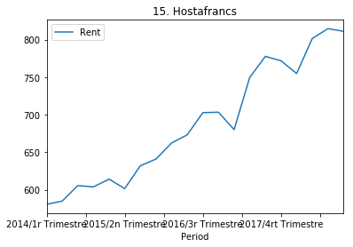


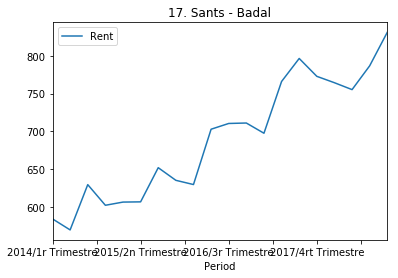


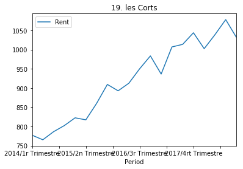


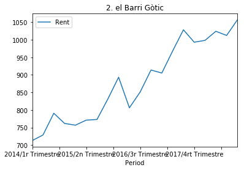


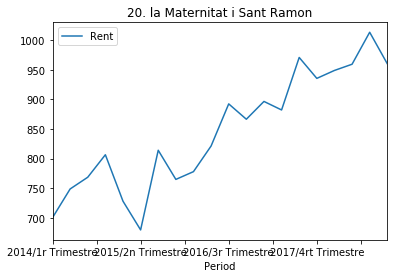


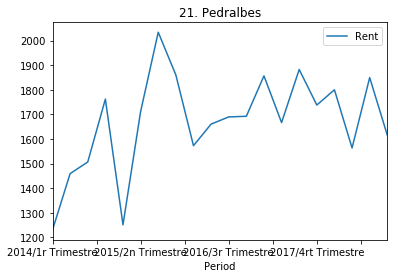


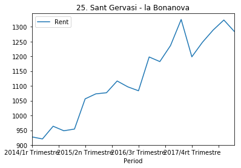


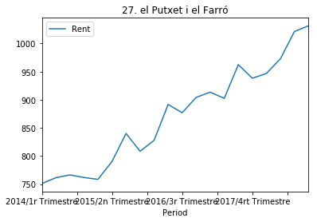


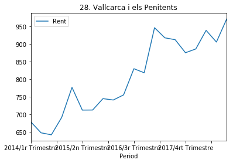


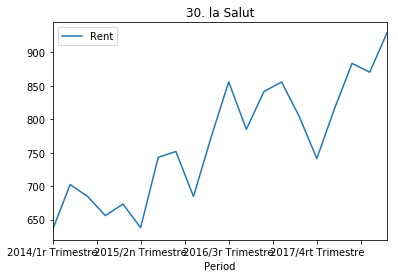


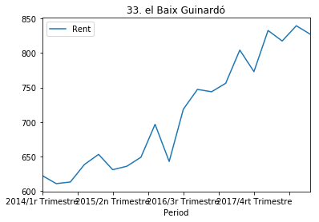


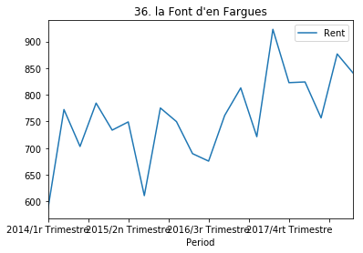


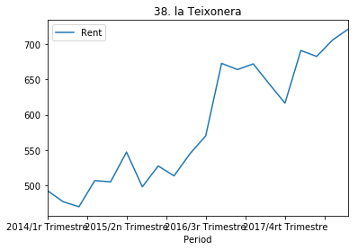


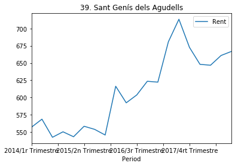


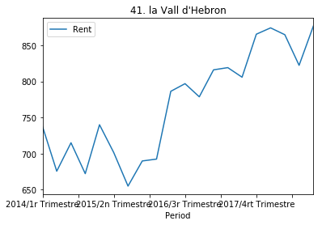


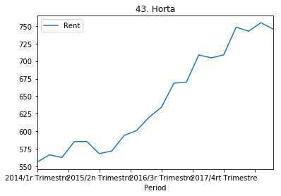


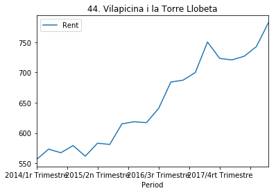


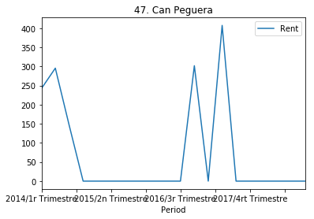


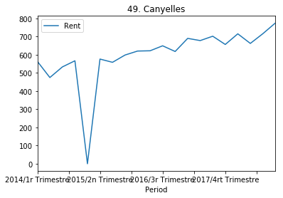


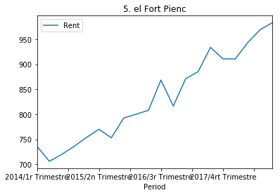


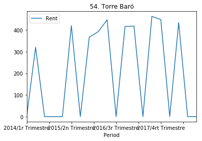


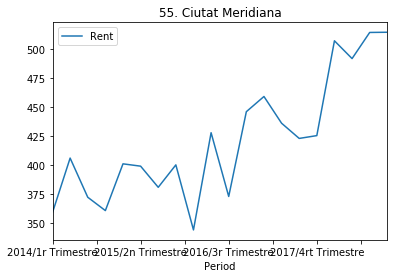


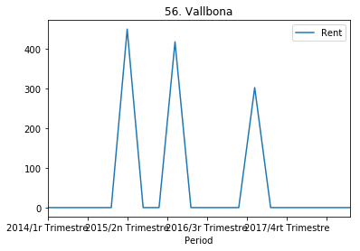


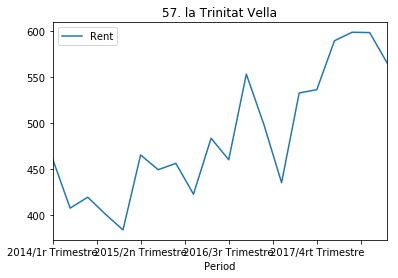


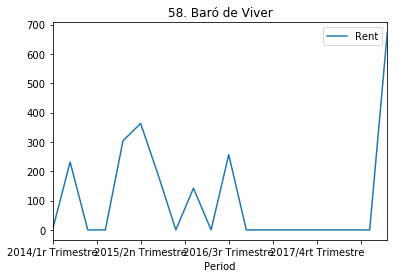


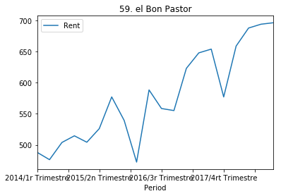


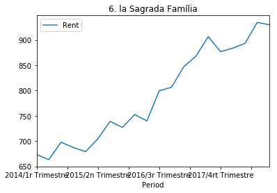


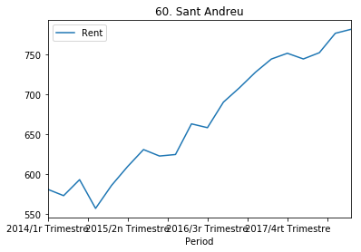


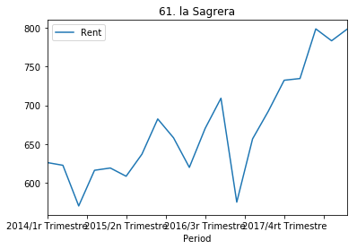


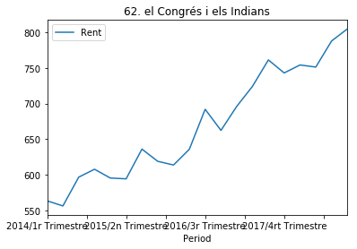


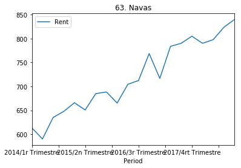


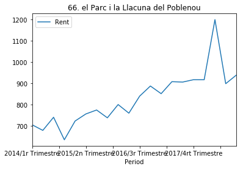


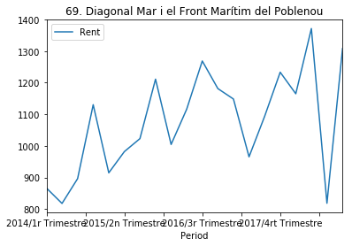


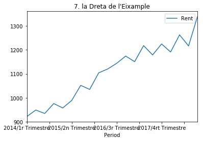


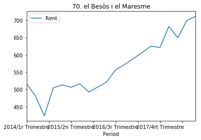


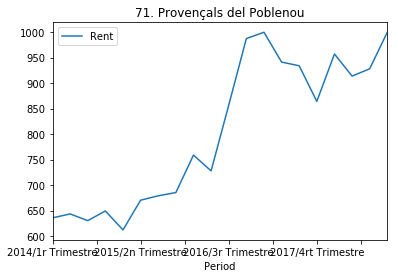


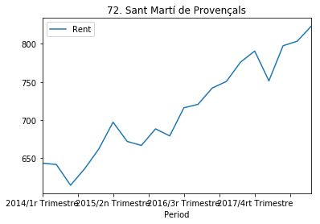


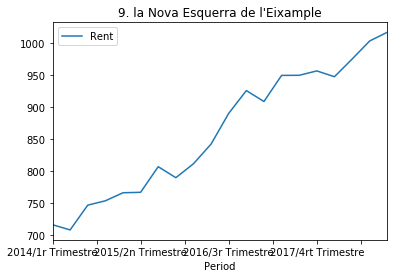

