# Evolució dels preus del lloger en Barcelona, des de 2014 fins a 2018
**Fa servir el dataset de dades oficial de OpenData BCN.**


```python
import pandas as pd
import matplotlib.pyplot as plt

pd.set_option('display.max_rows', 1000)
pd.set_option('display.max_columns', 1000)
        
def old_float(str):
    try: 
        return float(str.replace('.','').replace(',','.'))
    except:
        return 0

def new_float(str):
    try: 
        return float(str)
    except:
        return 0
    
CONVERTERS_OLD = {
    "1r Trimestre": old_float,
    "2n Trimestre": old_float,
    "3r Trimestre": old_float,
    "4rt Trimestre": old_float,
    
    "1r Trimestre.1": old_float,
    "2n Trimestre.1": old_float,
    "3r Trimestre.1": old_float,
    "4rt Trimestre.1": old_float,
    
    "Acumulat/1r Trimestre": old_float,
    "Acumulat/2n Trimestre": old_float,
    "Acumulat/3r Trimestre": old_float,
    "Acumulat/4rt Trimestre": old_float
}

CONVERTERS_NEW = {
    "1r Trimestre": new_float,
    "2n Trimestre": new_float,
    "3r Trimestre": new_float,
    "4rt Trimestre": new_float,
    
    "1r Trimestre.1": new_float,
    "2n Trimestre.1": new_float,
    "3r Trimestre.1": new_float,
    "4rt Trimestre.1": new_float,
    
    "Acumulat/1r Trimestre": new_float,
    "Acumulat/2n Trimestre": new_float,
    "Acumulat/3r Trimestre": new_float,
    "Acumulat/4rt Trimestre": new_float
}
```


```python
def parse_old_rent_dataset(df_name):
    df = pd.read_csv("../lib/avg-rent-eur-month/" + df_name, thousands=".", decimal=",", converters=CONVERTERS_OLD)
    return df.rename(columns={"1r Trimestre.1": "Acumulat/1r Trimestre", "2n Trimestre.1": "Acumulat/2n Trimestre", "3r Trimestre.1": "Acumulat/3r Trimestre", "4rt Trimestre.1": "Acumulat/4rt Trimestre"})[1:]

def parse_rent_dataset(df_name):
    return pd.read_csv("../lib/avg-rent-eur-month/" + df_name, converters=CONVERTERS_NEW)

def normalize(df, year):
    to_drop = ['Acumulat/1r Trimestre', 'Acumulat/2n Trimestre', 'Acumulat/3r Trimestre', 'Acumulat/4rt Trimestre', 'Dte.']
    df = df.drop(axis="columns", labels=to_drop)
    
    cols = ['1r Trimestre', '2n Trimestre', '3r Trimestre', '4rt Trimestre']
    for period in cols:
        rename_op = {}
        rename_op[period] = year + "/" + period
        df = df.rename(columns=rename_op)
        
    return df

def merge_rates(*dfs):
    df = dfs[0]
    for d in dfs[1:]:
        df = df.merge(d, how="left", on="Barris")
    
    return df
```


```python
monthly_rate_2014 = parse_old_rent_dataset("2014.csv")
monthly_rate_2015 = parse_old_rent_dataset("2015.csv")
monthly_rate_2016 = parse_old_rent_dataset("2016.csv")
monthly_rate_2017 = parse_rent_dataset("2017.csv")
monthly_rate_2018 = parse_rent_dataset("2018.csv")

monthly_rate_2014 = normalize(monthly_rate_2014, '2014')
monthly_rate_2015 = normalize(monthly_rate_2015, '2015')
monthly_rate_2016 = normalize(monthly_rate_2016, '2016')
monthly_rate_2017 = normalize(monthly_rate_2017, '2017')
monthly_rate_2018 = normalize(monthly_rate_2018, '2018')

all_monthly_rates = merge_rates(monthly_rate_2014, monthly_rate_2015, monthly_rate_2016, monthly_rate_2017, monthly_rate_2018)
all_monthly_rates = all_monthly_rates.fillna(0)
```


```python
with_ratio = all_monthly_rates.copy()
with_ratio['Creixement Total'] = with_ratio['2018/4rt Trimestre'] - with_ratio['2014/1r Trimestre']

with_ratio = with_ratio[['Barris', '2014/1r Trimestre', '2018/4rt Trimestre', 'Creixement Total']].rename(columns={'2014/1r Trimestre': "Primer Preu", '2018/4rt Trimestre': "Ultim Preu"})
with_ratio['Creixement %'] = (with_ratio['Creixement Total'] / with_ratio['Ultim Preu']) * 100

with_ratio = with_ratio[with_ratio["Primer Preu"] != 0]
with_ratio = with_ratio[with_ratio["Ultim Preu"] != 0]
```

## Barris mes cars


```python
with_ratio.sort_values('Ultim Preu', ascending=False).reset_index(drop=True).head(5)
```


<div>
<style scoped>
    .dataframe tbody tr th:only-of-type {
        vertical-align: middle;
    }

    .dataframe tbody tr th {
        vertical-align: top;
    }

    .dataframe thead th {
        text-align: right;
    }
</style>
<table border="1" class="dataframe">
  <thead>
    <tr style="text-align: right;">
      <th></th>
      <th>Barris</th>
      <th>Primer Preu</th>
      <th>Ultim Preu</th>
      <th>Creixement Total</th>
      <th>Creixement %</th>
    </tr>
  </thead>
  <tbody>
    <tr>
      <th>0</th>
      <td>21. Pedralbes</td>
      <td>1230.00</td>
      <td>1615.31</td>
      <td>385.31</td>
      <td>23.853626</td>
    </tr>
    <tr>
      <th>1</th>
      <td>24. les Tres Torres</td>
      <td>1215.85</td>
      <td>1567.91</td>
      <td>352.06</td>
      <td>22.454095</td>
    </tr>
    <tr>
      <th>2</th>
      <td>23. Sarrià</td>
      <td>1042.16</td>
      <td>1422.80</td>
      <td>380.64</td>
      <td>26.752882</td>
    </tr>
    <tr>
      <th>3</th>
      <td>26. Sant Gervasi - Galvany</td>
      <td>1053.70</td>
      <td>1374.82</td>
      <td>321.12</td>
      <td>23.357239</td>
    </tr>
    <tr>
      <th>4</th>
      <td>7. la Dreta de l'Eixample</td>
      <td>921.40</td>
      <td>1340.38</td>
      <td>418.98</td>
      <td>31.258300</td>
    </tr>
  </tbody>
</table>
</div>


## Barris mes barats


```python
with_ratio.sort_values('Ultim Preu', ascending=True).reset_index(drop=True).head(5)
```


<div>
<style scoped>
    .dataframe tbody tr th:only-of-type {
        vertical-align: middle;
    }

    .dataframe tbody tr th {
        vertical-align: top;
    }

    .dataframe thead th {
        text-align: right;
    }
</style>
<table border="1" class="dataframe">
  <thead>
    <tr style="text-align: right;">
      <th></th>
      <th>Barris</th>
      <th>Primer Preu</th>
      <th>Ultim Preu</th>
      <th>Creixement Total</th>
      <th>Creixement %</th>
    </tr>
  </thead>
  <tbody>
    <tr>
      <th>0</th>
      <td>55. Ciutat Meridiana</td>
      <td>359.27</td>
      <td>514.52</td>
      <td>155.25</td>
      <td>30.173754</td>
    </tr>
    <tr>
      <th>1</th>
      <td>57. la Trinitat Vella</td>
      <td>461.10</td>
      <td>564.56</td>
      <td>103.46</td>
      <td>18.325776</td>
    </tr>
    <tr>
      <th>2</th>
      <td>53. la Trinitat Nova</td>
      <td>442.94</td>
      <td>575.38</td>
      <td>132.44</td>
      <td>23.017832</td>
    </tr>
    <tr>
      <th>3</th>
      <td>50. les Roquetes</td>
      <td>461.28</td>
      <td>595.81</td>
      <td>134.53</td>
      <td>22.579346</td>
    </tr>
    <tr>
      <th>4</th>
      <td>51. Verdun</td>
      <td>503.47</td>
      <td>649.22</td>
      <td>145.75</td>
      <td>22.450017</td>
    </tr>
  </tbody>
</table>
</div>


## Llista ordenada de barris basat en el preu absolut de creixement del lloguer


```python
with_ratio.sort_values('Creixement Total', ascending=False).reset_index(drop=True)
```


<div>
<style scoped>
    .dataframe tbody tr th:only-of-type {
        vertical-align: middle;
    }

    .dataframe tbody tr th {
        vertical-align: top;
    }

    .dataframe thead th {
        text-align: right;
    }
</style>
<table border="1" class="dataframe">
  <thead>
    <tr style="text-align: right;">
      <th></th>
      <th>Barris</th>
      <th>Primer Preu</th>
      <th>Ultim Preu</th>
      <th>Creixement Total</th>
      <th>Creixement %</th>
    </tr>
  </thead>
  <tbody>
    <tr>
      <th>0</th>
      <td>69. Diagonal Mar i el Front Marítim del Poblenou</td>
      <td>866.70</td>
      <td>1307.79</td>
      <td>441.09</td>
      <td>33.727892</td>
    </tr>
    <tr>
      <th>1</th>
      <td>7. la Dreta de l'Eixample</td>
      <td>921.40</td>
      <td>1340.38</td>
      <td>418.98</td>
      <td>31.258300</td>
    </tr>
    <tr>
      <th>2</th>
      <td>21. Pedralbes</td>
      <td>1230.00</td>
      <td>1615.31</td>
      <td>385.31</td>
      <td>23.853626</td>
    </tr>
    <tr>
      <th>3</th>
      <td>23. Sarrià</td>
      <td>1042.16</td>
      <td>1422.80</td>
      <td>380.64</td>
      <td>26.752882</td>
    </tr>
    <tr>
      <th>4</th>
      <td>3. la Barceloneta</td>
      <td>540.71</td>
      <td>913.20</td>
      <td>372.49</td>
      <td>40.789531</td>
    </tr>
    <tr>
      <th>5</th>
      <td>67. la Vila Olímpica del Poblenou</td>
      <td>926.43</td>
      <td>1292.23</td>
      <td>365.80</td>
      <td>28.307654</td>
    </tr>
    <tr>
      <th>6</th>
      <td>71. Provençals del Poblenou</td>
      <td>635.70</td>
      <td>999.63</td>
      <td>363.93</td>
      <td>36.406470</td>
    </tr>
    <tr>
      <th>7</th>
      <td>25. Sant Gervasi - la Bonanova</td>
      <td>927.63</td>
      <td>1283.24</td>
      <td>355.61</td>
      <td>27.711886</td>
    </tr>
    <tr>
      <th>8</th>
      <td>24. les Tres Torres</td>
      <td>1215.85</td>
      <td>1567.91</td>
      <td>352.06</td>
      <td>22.454095</td>
    </tr>
    <tr>
      <th>9</th>
      <td>2. el Barri Gòtic</td>
      <td>712.79</td>
      <td>1057.26</td>
      <td>344.47</td>
      <td>32.581390</td>
    </tr>
    <tr>
      <th>10</th>
      <td>8. l'Antiga Esquerra de l'Eixample</td>
      <td>827.87</td>
      <td>1164.32</td>
      <td>336.45</td>
      <td>28.896695</td>
    </tr>
    <tr>
      <th>11</th>
      <td>4. Sant Pere, Santa Caterina i la Ribera</td>
      <td>673.44</td>
      <td>1000.52</td>
      <td>327.08</td>
      <td>32.691001</td>
    </tr>
    <tr>
      <th>12</th>
      <td>26. Sant Gervasi - Galvany</td>
      <td>1053.70</td>
      <td>1374.82</td>
      <td>321.12</td>
      <td>23.357239</td>
    </tr>
    <tr>
      <th>13</th>
      <td>68. el Poblenou</td>
      <td>663.93</td>
      <td>970.64</td>
      <td>306.71</td>
      <td>31.598739</td>
    </tr>
    <tr>
      <th>14</th>
      <td>9. la Nova Esquerra de l'Eixample</td>
      <td>716.13</td>
      <td>1017.56</td>
      <td>301.43</td>
      <td>29.622823</td>
    </tr>
    <tr>
      <th>15</th>
      <td>30. la Salut</td>
      <td>634.48</td>
      <td>930.09</td>
      <td>295.61</td>
      <td>31.782946</td>
    </tr>
    <tr>
      <th>16</th>
      <td>28. Vallcarca i els Penitents</td>
      <td>679.66</td>
      <td>971.51</td>
      <td>291.85</td>
      <td>30.040864</td>
    </tr>
    <tr>
      <th>17</th>
      <td>27. el Putxet i el Farró</td>
      <td>750.84</td>
      <td>1031.54</td>
      <td>280.70</td>
      <td>27.211742</td>
    </tr>
    <tr>
      <th>18</th>
      <td>32. el Camp d'en Grassot i Gràcia Nova</td>
      <td>671.00</td>
      <td>945.81</td>
      <td>274.81</td>
      <td>29.055519</td>
    </tr>
    <tr>
      <th>19</th>
      <td>64. el Camp de l'Arpa del Clot</td>
      <td>580.09</td>
      <td>851.58</td>
      <td>271.49</td>
      <td>31.880739</td>
    </tr>
    <tr>
      <th>20</th>
      <td>10. Sant Antoni</td>
      <td>693.43</td>
      <td>960.30</td>
      <td>266.87</td>
      <td>27.790274</td>
    </tr>
    <tr>
      <th>21</th>
      <td>20. la Maternitat i Sant Ramon</td>
      <td>700.16</td>
      <td>960.03</td>
      <td>259.87</td>
      <td>27.068946</td>
    </tr>
    <tr>
      <th>22</th>
      <td>6. la Sagrada Família</td>
      <td>673.37</td>
      <td>930.02</td>
      <td>256.65</td>
      <td>27.596181</td>
    </tr>
    <tr>
      <th>23</th>
      <td>36. la Font d'en Fargues</td>
      <td>585.45</td>
      <td>840.52</td>
      <td>255.07</td>
      <td>30.346690</td>
    </tr>
    <tr>
      <th>24</th>
      <td>19. les Corts</td>
      <td>777.23</td>
      <td>1031.46</td>
      <td>254.23</td>
      <td>24.647587</td>
    </tr>
    <tr>
      <th>25</th>
      <td>31. la Vila de Gràcia</td>
      <td>679.80</td>
      <td>927.06</td>
      <td>247.26</td>
      <td>26.671413</td>
    </tr>
    <tr>
      <th>26</th>
      <td>5. el Fort Pienc</td>
      <td>736.09</td>
      <td>983.10</td>
      <td>247.01</td>
      <td>25.125623</td>
    </tr>
    <tr>
      <th>27</th>
      <td>17. Sants - Badal</td>
      <td>584.27</td>
      <td>831.19</td>
      <td>246.92</td>
      <td>29.706806</td>
    </tr>
    <tr>
      <th>28</th>
      <td>11. el Poble Sec - AEI Parc Montjuïc</td>
      <td>568.00</td>
      <td>813.74</td>
      <td>245.74</td>
      <td>30.198835</td>
    </tr>
    <tr>
      <th>29</th>
      <td>62. el Congrés i els Indians</td>
      <td>563.42</td>
      <td>804.74</td>
      <td>241.32</td>
      <td>29.987325</td>
    </tr>
    <tr>
      <th>30</th>
      <td>1. el Raval</td>
      <td>589.55</td>
      <td>827.27</td>
      <td>237.72</td>
      <td>28.735479</td>
    </tr>
    <tr>
      <th>31</th>
      <td>66. el Parc i la Llacuna del Poblenou</td>
      <td>704.67</td>
      <td>938.59</td>
      <td>233.92</td>
      <td>24.922490</td>
    </tr>
    <tr>
      <th>32</th>
      <td>65. el Clot</td>
      <td>604.85</td>
      <td>835.55</td>
      <td>230.70</td>
      <td>27.610556</td>
    </tr>
    <tr>
      <th>33</th>
      <td>15. Hostafrancs</td>
      <td>580.71</td>
      <td>811.00</td>
      <td>230.29</td>
      <td>28.395808</td>
    </tr>
    <tr>
      <th>34</th>
      <td>18. Sants</td>
      <td>605.28</td>
      <td>834.64</td>
      <td>229.36</td>
      <td>27.480111</td>
    </tr>
    <tr>
      <th>35</th>
      <td>38. la Teixonera</td>
      <td>492.79</td>
      <td>721.23</td>
      <td>228.44</td>
      <td>31.673669</td>
    </tr>
    <tr>
      <th>36</th>
      <td>44. Vilapicina i la Torre Llobeta</td>
      <td>555.89</td>
      <td>782.95</td>
      <td>227.06</td>
      <td>29.000575</td>
    </tr>
    <tr>
      <th>37</th>
      <td>63. Navas</td>
      <td>613.47</td>
      <td>840.01</td>
      <td>226.54</td>
      <td>26.968727</td>
    </tr>
    <tr>
      <th>38</th>
      <td>13. la Marina de Port</td>
      <td>553.55</td>
      <td>778.52</td>
      <td>224.97</td>
      <td>28.897138</td>
    </tr>
    <tr>
      <th>39</th>
      <td>16. la Bordeta</td>
      <td>604.74</td>
      <td>825.36</td>
      <td>220.62</td>
      <td>26.730154</td>
    </tr>
    <tr>
      <th>40</th>
      <td>46. el Turó de la Peira</td>
      <td>475.06</td>
      <td>692.05</td>
      <td>216.99</td>
      <td>31.354671</td>
    </tr>
    <tr>
      <th>41</th>
      <td>40. Montbau</td>
      <td>537.94</td>
      <td>750.95</td>
      <td>213.01</td>
      <td>28.365404</td>
    </tr>
    <tr>
      <th>42</th>
      <td>49. Canyelles</td>
      <td>563.33</td>
      <td>774.38</td>
      <td>211.05</td>
      <td>27.254061</td>
    </tr>
    <tr>
      <th>43</th>
      <td>35. el Guinardó</td>
      <td>586.50</td>
      <td>796.35</td>
      <td>209.85</td>
      <td>26.351479</td>
    </tr>
    <tr>
      <th>44</th>
      <td>59. el Bon Pastor</td>
      <td>488.14</td>
      <td>696.06</td>
      <td>207.92</td>
      <td>29.870988</td>
    </tr>
    <tr>
      <th>45</th>
      <td>33. el Baix Guinardó</td>
      <td>622.63</td>
      <td>827.04</td>
      <td>204.41</td>
      <td>24.715854</td>
    </tr>
    <tr>
      <th>46</th>
      <td>60. Sant Andreu</td>
      <td>581.16</td>
      <td>782.15</td>
      <td>200.99</td>
      <td>25.697117</td>
    </tr>
    <tr>
      <th>47</th>
      <td>45. Porta</td>
      <td>523.29</td>
      <td>723.34</td>
      <td>200.05</td>
      <td>27.656427</td>
    </tr>
    <tr>
      <th>48</th>
      <td>70. el Besòs i el Maresme</td>
      <td>516.90</td>
      <td>711.67</td>
      <td>194.77</td>
      <td>27.368022</td>
    </tr>
    <tr>
      <th>49</th>
      <td>43. Horta</td>
      <td>556.30</td>
      <td>745.35</td>
      <td>189.05</td>
      <td>25.363923</td>
    </tr>
    <tr>
      <th>50</th>
      <td>73. la Verneda i la Pau</td>
      <td>568.68</td>
      <td>756.10</td>
      <td>187.42</td>
      <td>24.787726</td>
    </tr>
    <tr>
      <th>51</th>
      <td>72. Sant Martí de Provençals</td>
      <td>643.66</td>
      <td>823.46</td>
      <td>179.80</td>
      <td>21.834697</td>
    </tr>
    <tr>
      <th>52</th>
      <td>14. la Font de la Guatlla</td>
      <td>631.50</td>
      <td>810.24</td>
      <td>178.74</td>
      <td>22.060130</td>
    </tr>
    <tr>
      <th>53</th>
      <td>52. la Prosperitat</td>
      <td>521.81</td>
      <td>698.08</td>
      <td>176.27</td>
      <td>25.250688</td>
    </tr>
    <tr>
      <th>54</th>
      <td>37. el Carmel</td>
      <td>478.70</td>
      <td>653.21</td>
      <td>174.51</td>
      <td>26.715758</td>
    </tr>
    <tr>
      <th>55</th>
      <td>61. la Sagrera</td>
      <td>626.26</td>
      <td>798.32</td>
      <td>172.06</td>
      <td>21.552761</td>
    </tr>
    <tr>
      <th>56</th>
      <td>29. el Coll</td>
      <td>583.93</td>
      <td>748.90</td>
      <td>164.97</td>
      <td>22.028308</td>
    </tr>
    <tr>
      <th>57</th>
      <td>34. Can Baró</td>
      <td>568.94</td>
      <td>727.05</td>
      <td>158.11</td>
      <td>21.746785</td>
    </tr>
    <tr>
      <th>58</th>
      <td>55. Ciutat Meridiana</td>
      <td>359.27</td>
      <td>514.52</td>
      <td>155.25</td>
      <td>30.173754</td>
    </tr>
    <tr>
      <th>59</th>
      <td>51. Verdun</td>
      <td>503.47</td>
      <td>649.22</td>
      <td>145.75</td>
      <td>22.450017</td>
    </tr>
    <tr>
      <th>60</th>
      <td>41. la Vall d'Hebron</td>
      <td>737.73</td>
      <td>876.65</td>
      <td>138.92</td>
      <td>15.846689</td>
    </tr>
    <tr>
      <th>61</th>
      <td>50. les Roquetes</td>
      <td>461.28</td>
      <td>595.81</td>
      <td>134.53</td>
      <td>22.579346</td>
    </tr>
    <tr>
      <th>62</th>
      <td>53. la Trinitat Nova</td>
      <td>442.94</td>
      <td>575.38</td>
      <td>132.44</td>
      <td>23.017832</td>
    </tr>
    <tr>
      <th>63</th>
      <td>39. Sant Genís dels Agudells</td>
      <td>557.00</td>
      <td>666.91</td>
      <td>109.91</td>
      <td>16.480485</td>
    </tr>
    <tr>
      <th>64</th>
      <td>57. la Trinitat Vella</td>
      <td>461.10</td>
      <td>564.56</td>
      <td>103.46</td>
      <td>18.325776</td>
    </tr>
    <tr>
      <th>65</th>
      <td>48. la Guineueta</td>
      <td>613.58</td>
      <td>708.41</td>
      <td>94.83</td>
      <td>13.386316</td>
    </tr>
    <tr>
      <th>66</th>
      <td>22. Vallvidrera, el Tibidabo i les Planes</td>
      <td>837.33</td>
      <td>898.33</td>
      <td>61.00</td>
      <td>6.790378</td>
    </tr>
  </tbody>
</table>
</div>


## Llista ordenada de barris basat en el ratio de creixement del lloguer


```python
with_ratio.sort_values('Creixement %', ascending=False).reset_index(drop=True)
```


<div>
<style scoped>
    .dataframe tbody tr th:only-of-type {
        vertical-align: middle;
    }

    .dataframe tbody tr th {
        vertical-align: top;
    }

    .dataframe thead th {
        text-align: right;
    }
</style>
<table border="1" class="dataframe">
  <thead>
    <tr style="text-align: right;">
      <th></th>
      <th>Barris</th>
      <th>Primer Preu</th>
      <th>Ultim Preu</th>
      <th>Creixement Total</th>
      <th>Creixement %</th>
    </tr>
  </thead>
  <tbody>
    <tr>
      <th>0</th>
      <td>3. la Barceloneta</td>
      <td>540.71</td>
      <td>913.20</td>
      <td>372.49</td>
      <td>40.789531</td>
    </tr>
    <tr>
      <th>1</th>
      <td>71. Provençals del Poblenou</td>
      <td>635.70</td>
      <td>999.63</td>
      <td>363.93</td>
      <td>36.406470</td>
    </tr>
    <tr>
      <th>2</th>
      <td>69. Diagonal Mar i el Front Marítim del Poblenou</td>
      <td>866.70</td>
      <td>1307.79</td>
      <td>441.09</td>
      <td>33.727892</td>
    </tr>
    <tr>
      <th>3</th>
      <td>4. Sant Pere, Santa Caterina i la Ribera</td>
      <td>673.44</td>
      <td>1000.52</td>
      <td>327.08</td>
      <td>32.691001</td>
    </tr>
    <tr>
      <th>4</th>
      <td>2. el Barri Gòtic</td>
      <td>712.79</td>
      <td>1057.26</td>
      <td>344.47</td>
      <td>32.581390</td>
    </tr>
    <tr>
      <th>5</th>
      <td>64. el Camp de l'Arpa del Clot</td>
      <td>580.09</td>
      <td>851.58</td>
      <td>271.49</td>
      <td>31.880739</td>
    </tr>
    <tr>
      <th>6</th>
      <td>30. la Salut</td>
      <td>634.48</td>
      <td>930.09</td>
      <td>295.61</td>
      <td>31.782946</td>
    </tr>
    <tr>
      <th>7</th>
      <td>38. la Teixonera</td>
      <td>492.79</td>
      <td>721.23</td>
      <td>228.44</td>
      <td>31.673669</td>
    </tr>
    <tr>
      <th>8</th>
      <td>68. el Poblenou</td>
      <td>663.93</td>
      <td>970.64</td>
      <td>306.71</td>
      <td>31.598739</td>
    </tr>
    <tr>
      <th>9</th>
      <td>46. el Turó de la Peira</td>
      <td>475.06</td>
      <td>692.05</td>
      <td>216.99</td>
      <td>31.354671</td>
    </tr>
    <tr>
      <th>10</th>
      <td>7. la Dreta de l'Eixample</td>
      <td>921.40</td>
      <td>1340.38</td>
      <td>418.98</td>
      <td>31.258300</td>
    </tr>
    <tr>
      <th>11</th>
      <td>36. la Font d'en Fargues</td>
      <td>585.45</td>
      <td>840.52</td>
      <td>255.07</td>
      <td>30.346690</td>
    </tr>
    <tr>
      <th>12</th>
      <td>11. el Poble Sec - AEI Parc Montjuïc</td>
      <td>568.00</td>
      <td>813.74</td>
      <td>245.74</td>
      <td>30.198835</td>
    </tr>
    <tr>
      <th>13</th>
      <td>55. Ciutat Meridiana</td>
      <td>359.27</td>
      <td>514.52</td>
      <td>155.25</td>
      <td>30.173754</td>
    </tr>
    <tr>
      <th>14</th>
      <td>28. Vallcarca i els Penitents</td>
      <td>679.66</td>
      <td>971.51</td>
      <td>291.85</td>
      <td>30.040864</td>
    </tr>
    <tr>
      <th>15</th>
      <td>62. el Congrés i els Indians</td>
      <td>563.42</td>
      <td>804.74</td>
      <td>241.32</td>
      <td>29.987325</td>
    </tr>
    <tr>
      <th>16</th>
      <td>59. el Bon Pastor</td>
      <td>488.14</td>
      <td>696.06</td>
      <td>207.92</td>
      <td>29.870988</td>
    </tr>
    <tr>
      <th>17</th>
      <td>17. Sants - Badal</td>
      <td>584.27</td>
      <td>831.19</td>
      <td>246.92</td>
      <td>29.706806</td>
    </tr>
    <tr>
      <th>18</th>
      <td>9. la Nova Esquerra de l'Eixample</td>
      <td>716.13</td>
      <td>1017.56</td>
      <td>301.43</td>
      <td>29.622823</td>
    </tr>
    <tr>
      <th>19</th>
      <td>32. el Camp d'en Grassot i Gràcia Nova</td>
      <td>671.00</td>
      <td>945.81</td>
      <td>274.81</td>
      <td>29.055519</td>
    </tr>
    <tr>
      <th>20</th>
      <td>44. Vilapicina i la Torre Llobeta</td>
      <td>555.89</td>
      <td>782.95</td>
      <td>227.06</td>
      <td>29.000575</td>
    </tr>
    <tr>
      <th>21</th>
      <td>13. la Marina de Port</td>
      <td>553.55</td>
      <td>778.52</td>
      <td>224.97</td>
      <td>28.897138</td>
    </tr>
    <tr>
      <th>22</th>
      <td>8. l'Antiga Esquerra de l'Eixample</td>
      <td>827.87</td>
      <td>1164.32</td>
      <td>336.45</td>
      <td>28.896695</td>
    </tr>
    <tr>
      <th>23</th>
      <td>1. el Raval</td>
      <td>589.55</td>
      <td>827.27</td>
      <td>237.72</td>
      <td>28.735479</td>
    </tr>
    <tr>
      <th>24</th>
      <td>15. Hostafrancs</td>
      <td>580.71</td>
      <td>811.00</td>
      <td>230.29</td>
      <td>28.395808</td>
    </tr>
    <tr>
      <th>25</th>
      <td>40. Montbau</td>
      <td>537.94</td>
      <td>750.95</td>
      <td>213.01</td>
      <td>28.365404</td>
    </tr>
    <tr>
      <th>26</th>
      <td>67. la Vila Olímpica del Poblenou</td>
      <td>926.43</td>
      <td>1292.23</td>
      <td>365.80</td>
      <td>28.307654</td>
    </tr>
    <tr>
      <th>27</th>
      <td>10. Sant Antoni</td>
      <td>693.43</td>
      <td>960.30</td>
      <td>266.87</td>
      <td>27.790274</td>
    </tr>
    <tr>
      <th>28</th>
      <td>25. Sant Gervasi - la Bonanova</td>
      <td>927.63</td>
      <td>1283.24</td>
      <td>355.61</td>
      <td>27.711886</td>
    </tr>
    <tr>
      <th>29</th>
      <td>45. Porta</td>
      <td>523.29</td>
      <td>723.34</td>
      <td>200.05</td>
      <td>27.656427</td>
    </tr>
    <tr>
      <th>30</th>
      <td>65. el Clot</td>
      <td>604.85</td>
      <td>835.55</td>
      <td>230.70</td>
      <td>27.610556</td>
    </tr>
    <tr>
      <th>31</th>
      <td>6. la Sagrada Família</td>
      <td>673.37</td>
      <td>930.02</td>
      <td>256.65</td>
      <td>27.596181</td>
    </tr>
    <tr>
      <th>32</th>
      <td>18. Sants</td>
      <td>605.28</td>
      <td>834.64</td>
      <td>229.36</td>
      <td>27.480111</td>
    </tr>
    <tr>
      <th>33</th>
      <td>70. el Besòs i el Maresme</td>
      <td>516.90</td>
      <td>711.67</td>
      <td>194.77</td>
      <td>27.368022</td>
    </tr>
    <tr>
      <th>34</th>
      <td>49. Canyelles</td>
      <td>563.33</td>
      <td>774.38</td>
      <td>211.05</td>
      <td>27.254061</td>
    </tr>
    <tr>
      <th>35</th>
      <td>27. el Putxet i el Farró</td>
      <td>750.84</td>
      <td>1031.54</td>
      <td>280.70</td>
      <td>27.211742</td>
    </tr>
    <tr>
      <th>36</th>
      <td>20. la Maternitat i Sant Ramon</td>
      <td>700.16</td>
      <td>960.03</td>
      <td>259.87</td>
      <td>27.068946</td>
    </tr>
    <tr>
      <th>37</th>
      <td>63. Navas</td>
      <td>613.47</td>
      <td>840.01</td>
      <td>226.54</td>
      <td>26.968727</td>
    </tr>
    <tr>
      <th>38</th>
      <td>23. Sarrià</td>
      <td>1042.16</td>
      <td>1422.80</td>
      <td>380.64</td>
      <td>26.752882</td>
    </tr>
    <tr>
      <th>39</th>
      <td>16. la Bordeta</td>
      <td>604.74</td>
      <td>825.36</td>
      <td>220.62</td>
      <td>26.730154</td>
    </tr>
    <tr>
      <th>40</th>
      <td>37. el Carmel</td>
      <td>478.70</td>
      <td>653.21</td>
      <td>174.51</td>
      <td>26.715758</td>
    </tr>
    <tr>
      <th>41</th>
      <td>31. la Vila de Gràcia</td>
      <td>679.80</td>
      <td>927.06</td>
      <td>247.26</td>
      <td>26.671413</td>
    </tr>
    <tr>
      <th>42</th>
      <td>35. el Guinardó</td>
      <td>586.50</td>
      <td>796.35</td>
      <td>209.85</td>
      <td>26.351479</td>
    </tr>
    <tr>
      <th>43</th>
      <td>60. Sant Andreu</td>
      <td>581.16</td>
      <td>782.15</td>
      <td>200.99</td>
      <td>25.697117</td>
    </tr>
    <tr>
      <th>44</th>
      <td>43. Horta</td>
      <td>556.30</td>
      <td>745.35</td>
      <td>189.05</td>
      <td>25.363923</td>
    </tr>
    <tr>
      <th>45</th>
      <td>52. la Prosperitat</td>
      <td>521.81</td>
      <td>698.08</td>
      <td>176.27</td>
      <td>25.250688</td>
    </tr>
    <tr>
      <th>46</th>
      <td>5. el Fort Pienc</td>
      <td>736.09</td>
      <td>983.10</td>
      <td>247.01</td>
      <td>25.125623</td>
    </tr>
    <tr>
      <th>47</th>
      <td>66. el Parc i la Llacuna del Poblenou</td>
      <td>704.67</td>
      <td>938.59</td>
      <td>233.92</td>
      <td>24.922490</td>
    </tr>
    <tr>
      <th>48</th>
      <td>73. la Verneda i la Pau</td>
      <td>568.68</td>
      <td>756.10</td>
      <td>187.42</td>
      <td>24.787726</td>
    </tr>
    <tr>
      <th>49</th>
      <td>33. el Baix Guinardó</td>
      <td>622.63</td>
      <td>827.04</td>
      <td>204.41</td>
      <td>24.715854</td>
    </tr>
    <tr>
      <th>50</th>
      <td>19. les Corts</td>
      <td>777.23</td>
      <td>1031.46</td>
      <td>254.23</td>
      <td>24.647587</td>
    </tr>
    <tr>
      <th>51</th>
      <td>21. Pedralbes</td>
      <td>1230.00</td>
      <td>1615.31</td>
      <td>385.31</td>
      <td>23.853626</td>
    </tr>
    <tr>
      <th>52</th>
      <td>26. Sant Gervasi - Galvany</td>
      <td>1053.70</td>
      <td>1374.82</td>
      <td>321.12</td>
      <td>23.357239</td>
    </tr>
    <tr>
      <th>53</th>
      <td>53. la Trinitat Nova</td>
      <td>442.94</td>
      <td>575.38</td>
      <td>132.44</td>
      <td>23.017832</td>
    </tr>
    <tr>
      <th>54</th>
      <td>50. les Roquetes</td>
      <td>461.28</td>
      <td>595.81</td>
      <td>134.53</td>
      <td>22.579346</td>
    </tr>
    <tr>
      <th>55</th>
      <td>24. les Tres Torres</td>
      <td>1215.85</td>
      <td>1567.91</td>
      <td>352.06</td>
      <td>22.454095</td>
    </tr>
    <tr>
      <th>56</th>
      <td>51. Verdun</td>
      <td>503.47</td>
      <td>649.22</td>
      <td>145.75</td>
      <td>22.450017</td>
    </tr>
    <tr>
      <th>57</th>
      <td>14. la Font de la Guatlla</td>
      <td>631.50</td>
      <td>810.24</td>
      <td>178.74</td>
      <td>22.060130</td>
    </tr>
    <tr>
      <th>58</th>
      <td>29. el Coll</td>
      <td>583.93</td>
      <td>748.90</td>
      <td>164.97</td>
      <td>22.028308</td>
    </tr>
    <tr>
      <th>59</th>
      <td>72. Sant Martí de Provençals</td>
      <td>643.66</td>
      <td>823.46</td>
      <td>179.80</td>
      <td>21.834697</td>
    </tr>
    <tr>
      <th>60</th>
      <td>34. Can Baró</td>
      <td>568.94</td>
      <td>727.05</td>
      <td>158.11</td>
      <td>21.746785</td>
    </tr>
    <tr>
      <th>61</th>
      <td>61. la Sagrera</td>
      <td>626.26</td>
      <td>798.32</td>
      <td>172.06</td>
      <td>21.552761</td>
    </tr>
    <tr>
      <th>62</th>
      <td>57. la Trinitat Vella</td>
      <td>461.10</td>
      <td>564.56</td>
      <td>103.46</td>
      <td>18.325776</td>
    </tr>
    <tr>
      <th>63</th>
      <td>39. Sant Genís dels Agudells</td>
      <td>557.00</td>
      <td>666.91</td>
      <td>109.91</td>
      <td>16.480485</td>
    </tr>
    <tr>
      <th>64</th>
      <td>41. la Vall d'Hebron</td>
      <td>737.73</td>
      <td>876.65</td>
      <td>138.92</td>
      <td>15.846689</td>
    </tr>
    <tr>
      <th>65</th>
      <td>48. la Guineueta</td>
      <td>613.58</td>
      <td>708.41</td>
      <td>94.83</td>
      <td>13.386316</td>
    </tr>
    <tr>
      <th>66</th>
      <td>22. Vallvidrera, el Tibidabo i les Planes</td>
      <td>837.33</td>
      <td>898.33</td>
      <td>61.00</td>
      <td>6.790378</td>
    </tr>
  </tbody>
</table>
</div>


## Grafica de linees de creixement per barri


```python
melted_monthly_rates = all_monthly_rates.melt(id_vars = "Barris", var_name="Period", value_name="Rent")

for title, group in melted_monthly_rates.groupby('Barris'):
    group.plot(x='Period', y='Rent', title=title)
```

    /opt/conda/lib/python3.7/site-packages/matplotlib/pyplot.py:514: RuntimeWarning: More than 20 figures have been opened. Figures created through the pyplot interface (`matplotlib.pyplot.figure`) are retained until explicitly closed and may consume too much memory. (To control this warning, see the rcParam `figure.max_open_warning`).
      max_open_warning, RuntimeWarning)


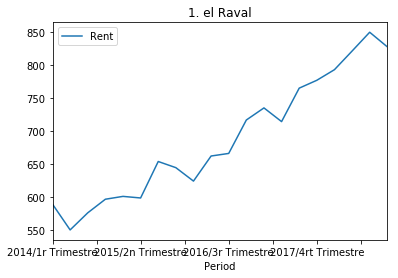


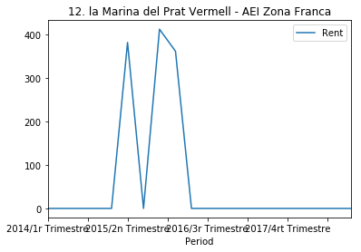


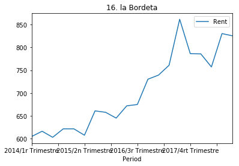


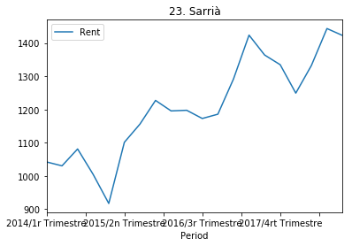


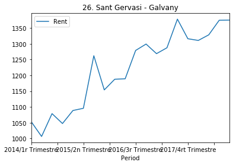


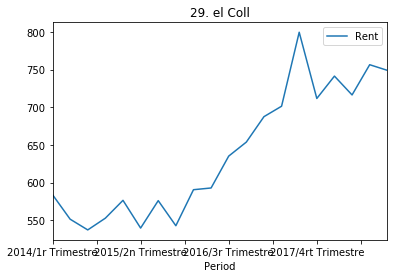


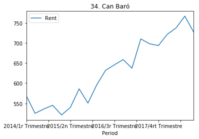


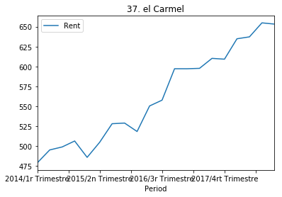


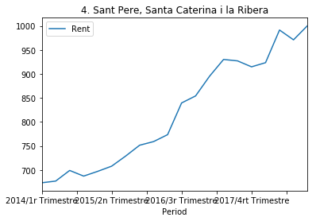


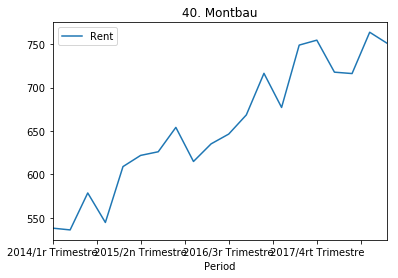


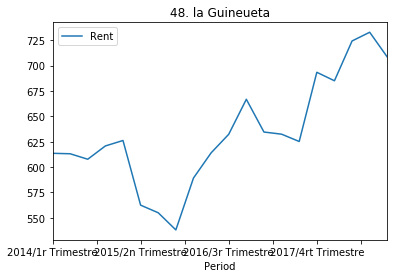


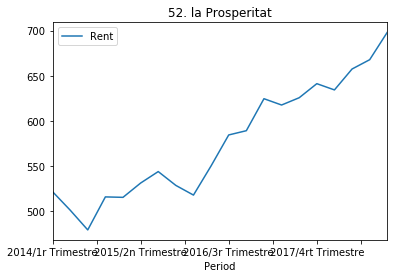


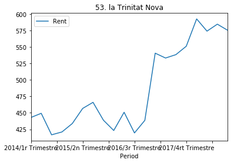


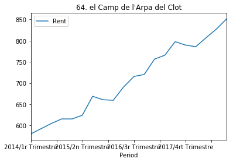


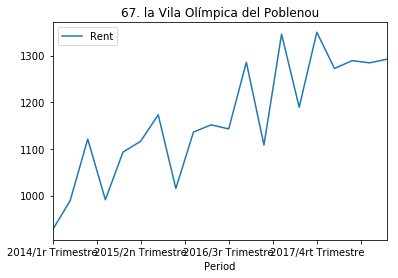


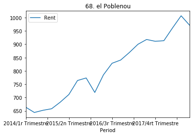


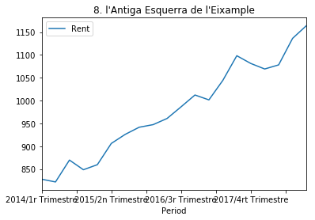


